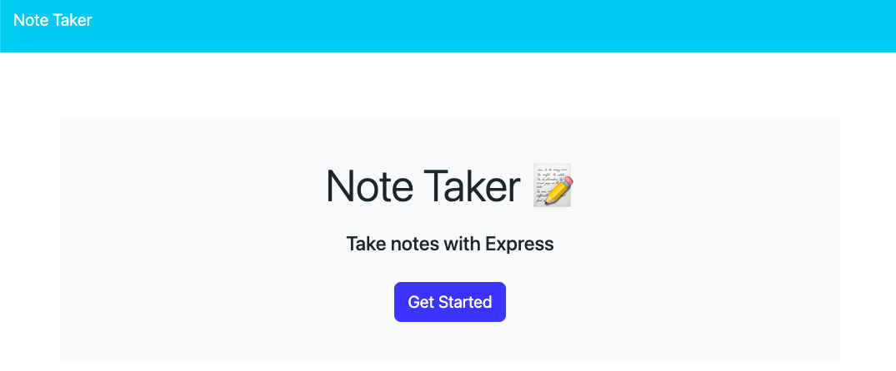
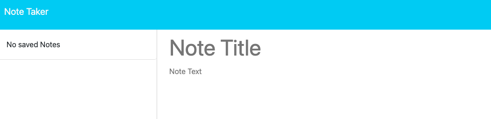
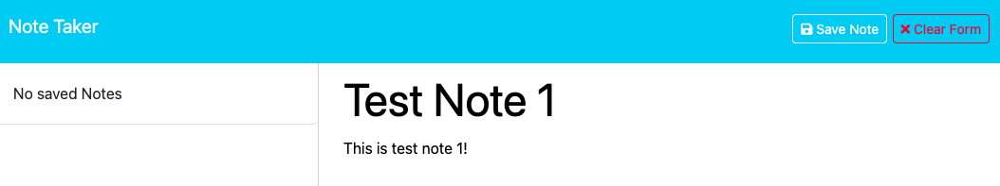
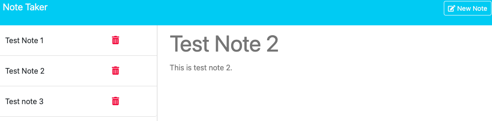
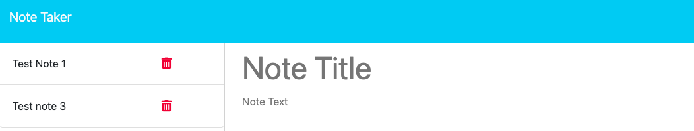

  # Note Taker
  
  ## Table of Contents
  1. [Instructions](#1-instructions)
  2. [Description](#2-description)
  3. [Contribution Guidelines](#3-contribution-guidelines)
  4. [Testing the Application](#4-testing-the-application)
  5. [License](#5-license)
  6. [Other Sources](#6-other-sources)
  7. [Questions](#7-questions)

  ## 1. Instructions
  The application requires Node.js with Express 4.16.4 and UUID 8.3.2 dependencies installed to run locally.

  ## 2. Description
  The purpose of the application is to allow the user to create, add to, and delete from a list of notes. When the user starts the application, they are taken to a splash screen where they can click "Get Started".
   
   
  
  
  They are redirected to a page where they are presented with a template to enter a "Note Title" and "Note Text". 
   
   
  
  
  As the user enters information into either field, they are provided with a "Clear Form" button to clear the form if desired. Once both fields are filled, the user is able to click a "Save Note" to clear out the form and add the note to the list on the side. The user can then click the sidebar notes to revisit and view the note text. 
   
   
  
   
   
  

  There is also a delete button that can be used to remove a note from the list.
   
   
  

  ## 3. Contribution Guidelines
  The application uses pre-existing code, so only approved contributions can be added.

  ## 4. Testing the Application
  The application can be tested using the browser application or Insomnia for routing get/post/delete requests. 

  ## 5. License
  MIT 
  https://opensource.org/licenses/MIT

  ## 6. Other Sources:
  Backend helper functions (note-taker/helpers/utils) used from course material to streamline the reading and writing of files for the application.

  ## 7. Questions:
  Contact me with questions at: 
    - Github: *jeremydray* 
    - Email: *jeremydray@gmail.com*